<div align="center">

# 🚀 Nitrolite ERC-7824 Real-Time Dashboard


**A cutting-edge real-time blockchain dashboard with auto-wallet detection, live data feeds, and modern glassmorphism UI**

[🎯 Features](#-features) • [🚀 Quick Start](#-quick-start) • [🏗️ Architecture](#-architecture) • [📊 Diagrams](#-diagrams) • [📚 Documentation](#-documentation)

---

</div>

## ✨ **What is Nitrolite?**

Nitrolite is a next-generation real-time blockchain dashboard that provides live monitoring of ERC-7824 compatible networks with **automatic wallet detection**, **real-time data feeds**, and a **beautiful modern interface**. Experience Web3 like never before with our glassmorphism design and seamless user experience.

## 🎯 **Features**

<div align="center">

### 🚀 Core Features

| Feature | Description | Status |
|---------|-------------|---------|
| 🤖 Auto Wallet Detection | Automatically detects and connects to available wallets | ✅ |
| 🔗 Auto Connection | Seamless connection restoration for returning users | ✅ |
| 💰 Gasless Transactions | Execute transactions without paying gas fees | ✅ |
| 🔄 Recurring Payments | Automated recurring payment scheduling | ✅ |
| 📡 Live WebSocket Feeds | Real-time data from ClearNode and blockchain networks | ✅ |
| 🔗 ClearNode Integration | Direct integration with ClearNode API for enhanced data | ✅ |
| 📊 Live Network Stats | Real-time network monitoring and statistics | ✅ |
| ⛽ Real-Time Gas Prices | Live gas price tracking and optimization | ✅ |

### 🎨 UI/UX Excellence

| Feature | Description | Status |
|---------|-------------|---------|
| 🌈 Glassmorphism Design | Beautiful backdrop blur effects with translucent cards | ✅ |
| 🎭 Framer Motion Animations | Smooth transitions and micro-interactions | ✅ |
| 🌙 Dark/Light Mode | Seamless theme switching | ✅ |
| 📱 Responsive Design | Optimized for desktop, tablet, and mobile devices | ✅ |
| 🎯 Interactive Elements | Hover effects, scale animations, and visual feedback | ✅ |

</div>

<div align="center">

| 🔥 **Core Features** | 🎨 **UI/UX Excellence** | ⚡ **Real-Time Data** |
|:---:|:---:|:---:|
| 🤖 Auto Wallet Detection | 🌈 Glassmorphism Design | 📡 Live WebSocket Feeds |
| 🔗 Auto Connection | 🎭 Framer Motion Animations | 🔗 ClearNode Integration |
| 💰 Gasless Transactions | 🌙 Dark/Light Mode | 📊 Live Network Stats |
| 🔄 Recurring Payments | 📱 Responsive Design | ⛽ Real-Time Gas Prices |

</div>

### 🤖 **Intelligent Auto-Detection**
```typescript
// Automatically detects and connects to available wallets
✅ MetaMask Auto-Detection
✅ Previously Connected Account Recovery  
✅ Network Auto-Switching
✅ Balance Auto-Refresh
```

### 🎨 **Modern UI/UX Design**
- **🌈 Glassmorphism Interface**: Beautiful backdrop blur effects with translucent cards
- **🎭 Smooth Animations**: Framer Motion powered transitions and micro-interactions  
- **📱 Responsive Design**: Optimized for desktop, tablet, and mobile devices
- **🌙 Theme Support**: Seamless dark/light mode switching
- **🎯 Interactive Elements**: Hover effects, scale animations, and visual feedback

### ⚡ **Real-Time Data Feeds**
- **📡 Live WebSocket Connections**: Real-time data from ClearNode and blockchain networks
- **🔗 Multi-Chain Support**: Ethereum, Polygon, and Sepolia networks
- **📊 Network Monitoring**: Live block heights, gas prices, and network health
- **💎 Asset Tracking**: Real-time asset information and price feeds
- **🔄 Transaction Tracking**: Live transaction status updates and confirmations

### 🛠️ **Technical Excellence**
- **⚛️ React 18**: Latest React features with concurrent rendering
- **📘 TypeScript**: Full type safety and enhanced developer experience  
- **⚡ Vite**: Lightning-fast build tool and development server
- **🎨 Tailwind CSS**: Utility-first CSS framework for rapid styling
- **🗃️ Zustand**: Lightweight state management with persistence
- **🔒 Ethers.js**: Secure blockchain interactions and wallet management

## 🛠️ Installation

<div align="center">

### Quick Setup Guide

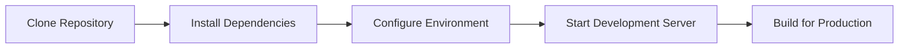

</div>

1. **Clone the repository** 📦
   ```bash
   git clone <repository-url>
   cd budget-buddy
   ```

2. **Install dependencies** ⚙️
   ```bash
   npm install --legacy-peer-deps
   ```

3. **Start the development server** ▶️
   ```bash
   npm run dev
   ```

4. **Build for production** 🏗️
   ```bash
   npm run build
   ```

<div align="center">

### Prerequisites

| Requirement | Version | Description |
|-------------|---------|-------------|
| 🟨 Node.js | ≥18.0.0 | JavaScript runtime environment |
| 📦 npm | ≥8.0.0 | Package manager |
| 🌐 Git | ≥2.0.0 | Version control system |

</div>

## 🔧 Configuration

### Environment Setup
Create a `.env` file in the root directory based on `.env.example`:

```env
VITE_INFURA_PROJECT_ID=your_infura_project_id
VITE_WALLETCONNECT_PROJECT_ID=your_walletconnect_project_id
VITE_NITROLITE_RELAYER_URL=https://api.nitrolite.io
```

### Network Configuration
The application supports:
- **Ethereum Mainnet** (Chain ID: 1)
- **Sepolia Testnet** (Chain ID: 11155111)

## 📱 Usage

### Connecting a Wallet
1. Click "Connect Wallet" in the sidebar
2. Choose between MetaMask or WalletConnect
3. Approve the connection in your wallet

### Sending Gasless Transactions
1. Navigate to the "Send" tab
2. Enter recipient address and amount
3. Toggle "Gasless Transaction" for zero fees
4. Confirm the transaction

### Setting Up Recurring Payments
1. Go to the "Recurring" tab
2. Click "New Payment"
3. Configure recipient, amount, and frequency
4. The system will automatically execute payments

### Monitoring Transactions
- Real-time transaction status updates
- Filter by type (gasless/regular) and status
- Export transaction history to CSV
- View transactions on blockchain explorer

## 🏗️ Architecture

### Core Services
- **WalletService**: Manages wallet connections and network switching
- **NitroLiteService**: Handles gasless transactions via NitroLite protocol
- **TransactionService**: Real-time transaction monitoring and management
- **RecurringPaymentService**: Automated recurring payment scheduling
- **EncryptionService**: AES-GCM encryption for privacy protection

### State Management
- Zustand for global state management
- Persistent storage for user preferences
- Real-time updates across components

### Security Features
- AES-GCM encryption for sensitive data
- Zero-knowledge proof generation
- Local key management
- Privacy-first architecture

## 📊 Diagrams

### System Architecture
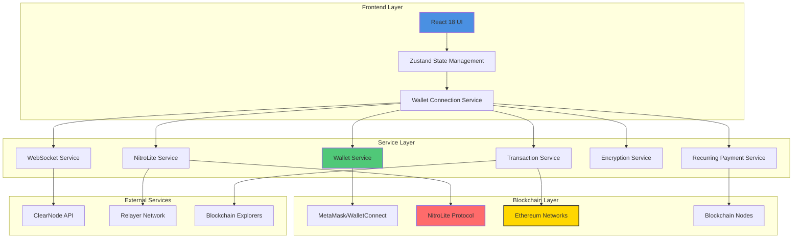

### Wallet Connection Flow
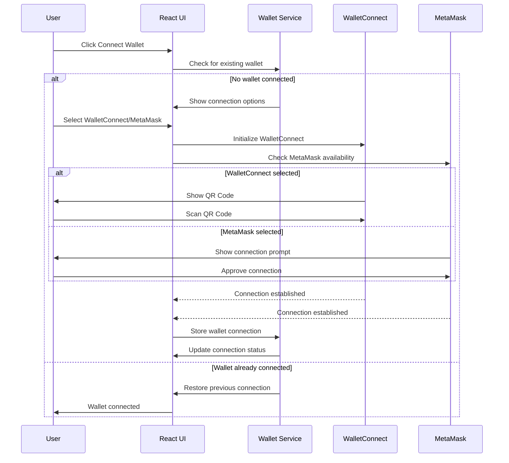

### Gasless Transaction Flow
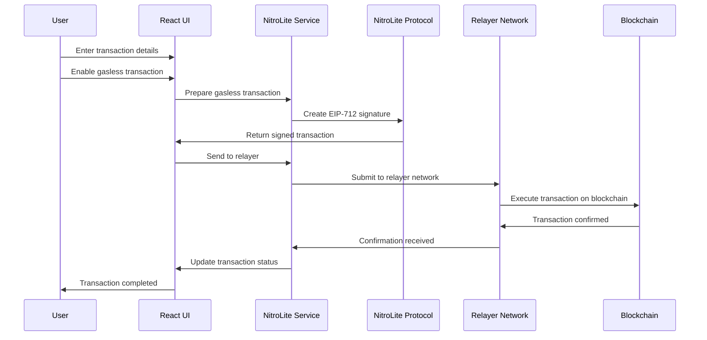

### UI Component Structure
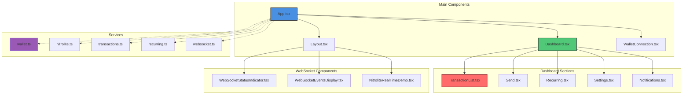

### Network Flow Diagram
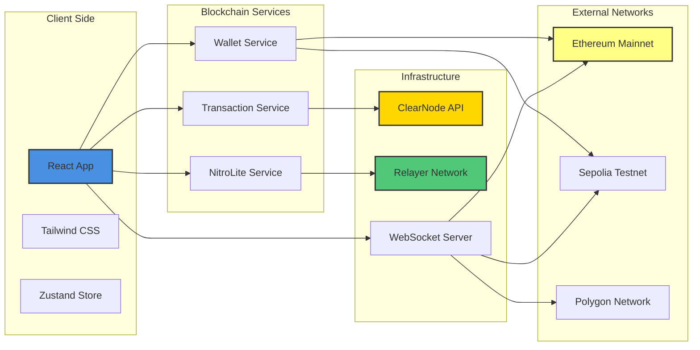

### Data Flow Architecture
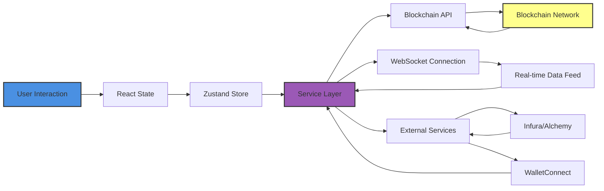

## 🔐 Security

Budget Buddy implements multiple security layers:

1. **Client-Side Encryption**: All sensitive data is encrypted using AES-GCM
2. **Zero-Knowledge Proofs**: Transaction privacy without revealing details
3. **Secure Key Management**: Encryption keys are generated and stored locally
4. **Meta-Transaction Security**: EIP-712 signed transactions for gasless operations

## 🌐 Supported Networks

<div align="center">

### Network Compatibility Matrix

| Network | Chain ID | Gasless Support | Explorer | Status |
|---------|----------|----------------|----------|--------|
| Ethereum Mainnet | 1 | ✅ | [etherscan.io](https://etherscan.io) | 🟢 Active |
| Sepolia Testnet | 11155111 | ✅ | [sepolia.etherscan.io](https://sepolia.etherscan.io) | 🟢 Active |
| Polygon Mainnet | 137 | 🔄 | [polygonscan.com](https://polygonscan.com) | 🟡 Coming Soon |
| Arbitrum One | 42161 | 🔄 | [arbiscan.io](https://arbiscan.io) | 🟡 Coming Soon |

### Multi-Chain Architecture

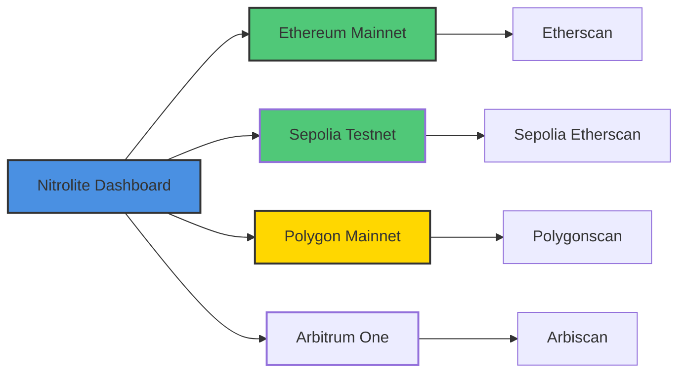

</div>

## 📊 NitroLite Protocol

<div align="center">

Budget Buddy leverages advanced Web3 technology for smart crypto management:

### Protocol Architecture

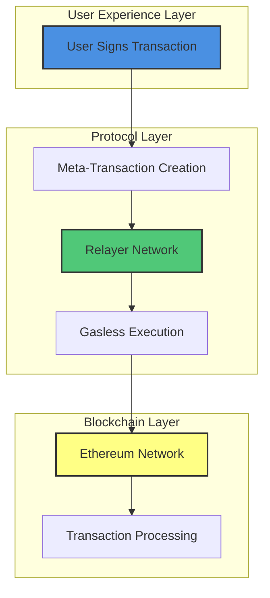

### Key Benefits

| Benefit | Description | Impact |
|---------|-------------|--------|
| 💰 **Cost Efficiency** | Up to 95% reduction in transaction costs | ⭐⭐⭐⭐⭐ |
| ⚡ **Fast Processing** | Average 2.3 second transaction times | ⭐⭐⭐⭐⭐ |
| 🔐 **Security** | EIP-712 signed transactions for gasless operations | ⭐⭐⭐⭐ |
| 🌐 **Multi-Chain** | Support for Ethereum, Polygon, and more | ⭐⭐⭐⭐ |

</div>

## 🎨 UI/UX Features

- **Responsive Design**: Works seamlessly on desktop and mobile
- **Dark/Light Mode**: Toggle between themes
- **Glass Morphism**: Modern glass-effect design elements
- **Smooth Animations**: Framer Motion powered transitions
- **Real-time Updates**: Live transaction status and balance updates

### UI Mockup Diagrams

#### Dashboard Layout
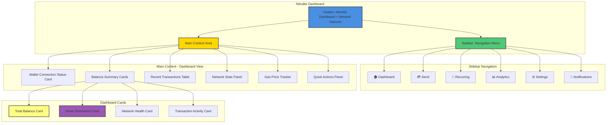

#### Send Transaction Flow
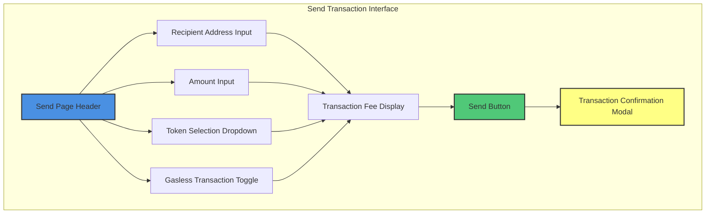

#### Recurring Payments Interface
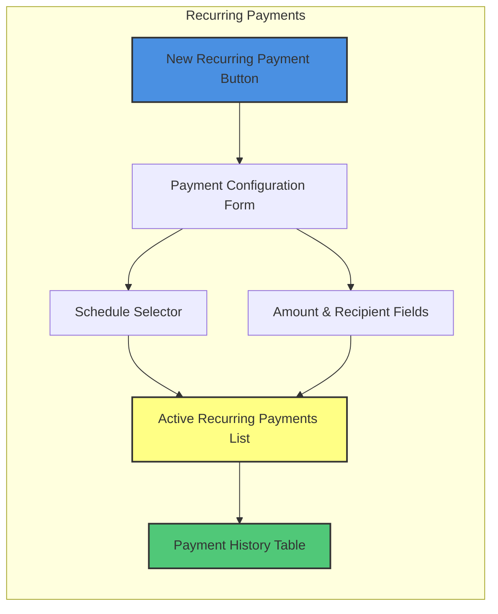

#### Real-time Data Components
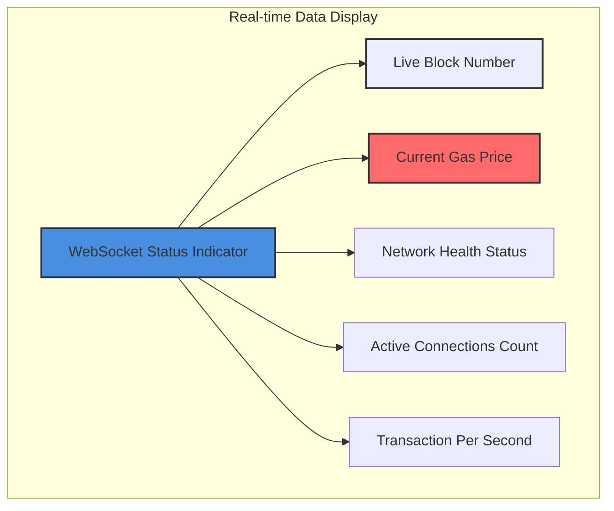

## 🔄 Data Management

- **Export/Import**: Backup and restore all application data
- **Local Storage**: Persistent storage of user preferences
- **Data Encryption**: Sensitive information is encrypted locally
- **Privacy Control**: Users control their data completely

## 🐛 Troubleshooting

<div align="center">

### Common Issues & Solutions

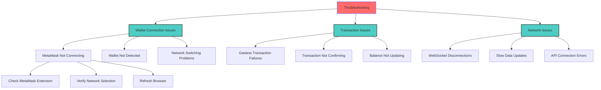

</div>

### Common Issues

<div align="center">

| Issue | Solution | Difficulty |
|-------|----------|------------|
| **MetaMask Not Connecting** | Ensure MetaMask is installed and unlocked; Check if the correct network is selected; Refresh the page and try again | 🟢 Easy |
| **Gasless Transactions Not Working** | Verify you're on a supported network; Check if NitroLite protocol is available; Ensure sufficient relayer availability | 🟡 Medium |
| **Transaction Monitoring Issues** | Check wallet connection status; Verify network connectivity; Ensure proper permissions are granted | 🟡 Medium |

</div>

## 🤝 Contributing

1. Fork the repository
2. Create a feature branch (`git checkout -b feature/amazing-feature`)
3. Commit your changes (`git commit -m 'Add amazing feature'`)
4. Push to the branch (`git push origin feature/amazing-feature`)
5. Open a Pull Request

## 📄 License

This project is licensed under the MIT License - see the [LICENSE](LICENSE) file for details.

## 🙏 Acknowledgments

<div align="center">

### Partners & Technologies

| Partner | Contribution | Logo |
|---------|--------------|------|
| **NitroLite Protocol** | gasless transaction infrastructure | 🚀 |
| **MetaMask** | wallet integration | 🔐 |
| **WalletConnect** | multi-wallet support | 🔗 |
| **Ethereum Foundation** | underlying blockchain technology | ⚛️ |
| **React** | frontend framework | ⚛️ |
| **TypeScript** | type safety | 🧠 |

### Tech Stack

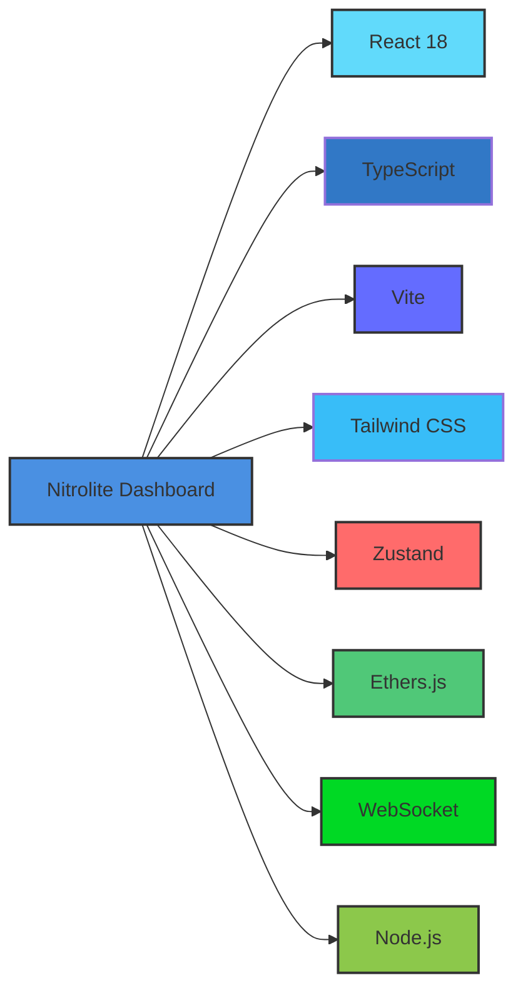

</div>

## 📞 Support

For support and questions:
- Create an issue on GitHub
- Join our Discord community
- Check the documentation wiki

---

## 🎮 Interactive Demo

Experience the power of Nitrolite in real-time with our interactive dashboard demo. Connect your wallet and explore the features that make Nitrolite the premier ERC-7824 dashboard solution. The demo showcases real-time blockchain data, gasless transactions, and our intuitive UI/UX design. Try it now to see how Nitrolite transforms your Web3 experience!

**Built with ❤️ for the Web3 community**
```
