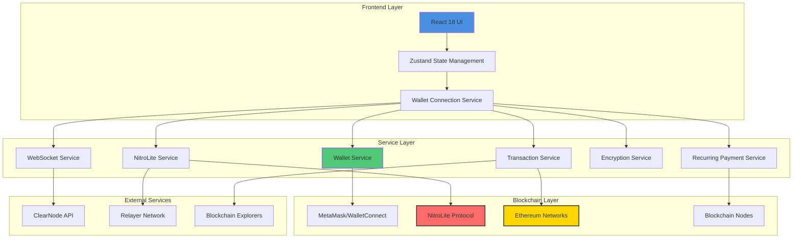
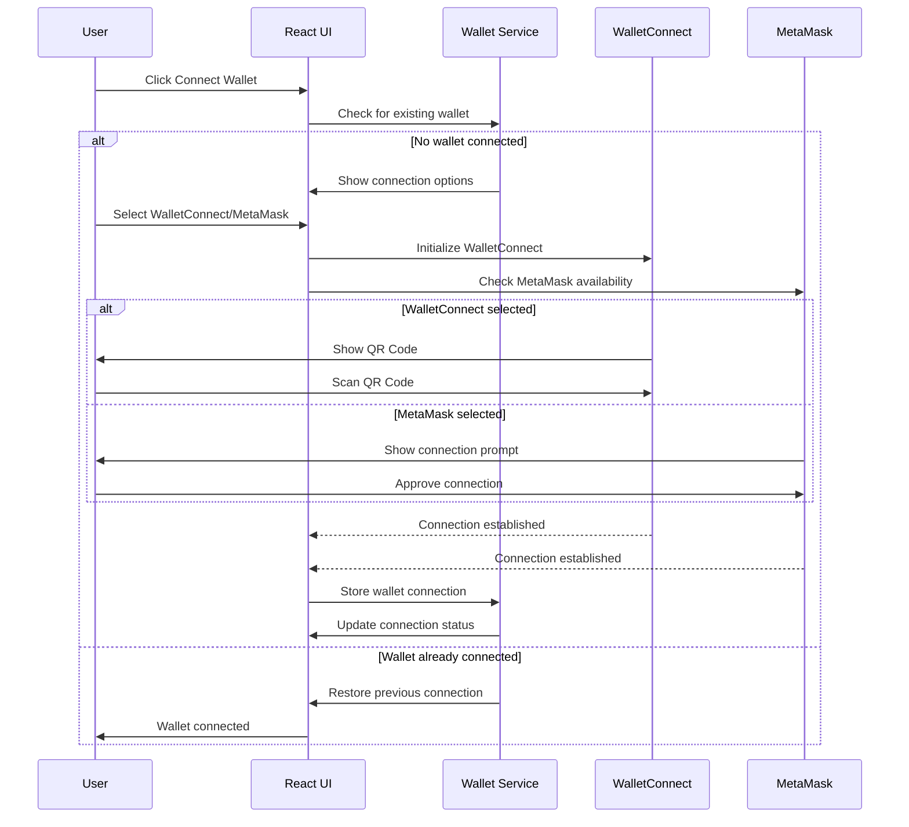
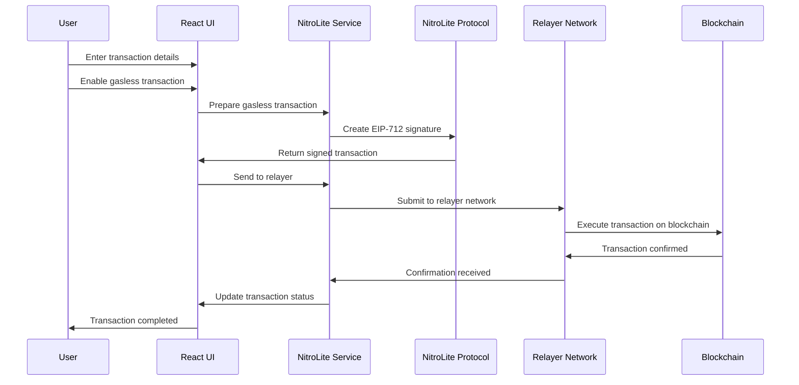
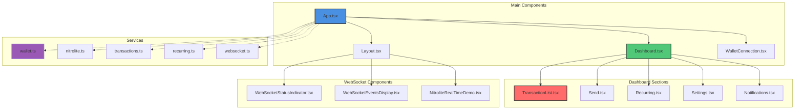
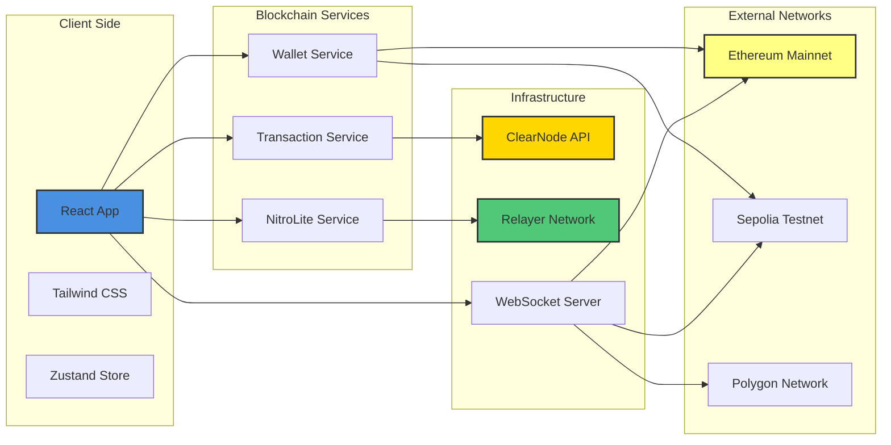

# Nitrolite Architecture Diagrams

## System Architecture



## Wallet Connection Flow



## Gasless Transaction Flow



## UI Component Structure



## Network Flow Diagram



## Data Flow Architecture

```mermaid
graph LR
    A[User Interaction] --> B[React State]
    B --> C[Zustand Store]
    C --> D[Service Layer]
    D --> E[Blockchain API]
    D --> F[WebSocket Connection]
    D --> G[External Services]
    E --> H[Blockchain Network]
    F --> I[Real-time Data Feed]
    G --> J[Infura/Alchemy]
    G --> K[WalletConnect]
    
    I --> D
    H --> E
    J --> G
    K --> D
    
    style A fill:#4A90E2,stroke:#333,stroke-width:2px
    style D fill:#9B59B6,stroke:#333,stroke-width:2px
    style H fill:#FF6B,stroke:#333,stroke-width:2px