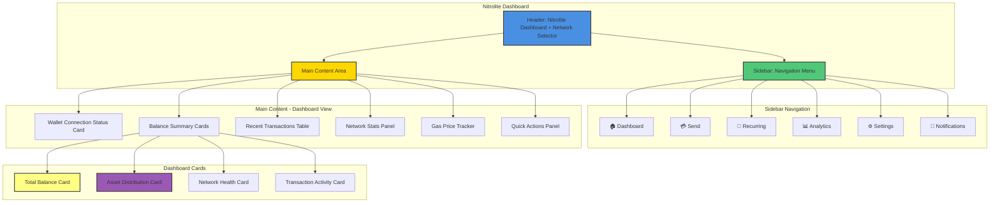
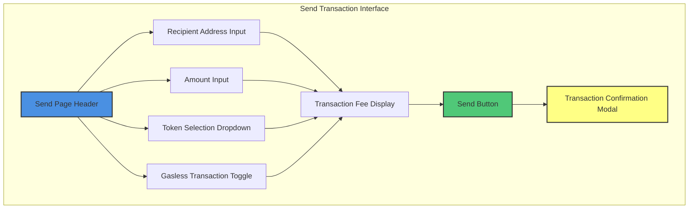
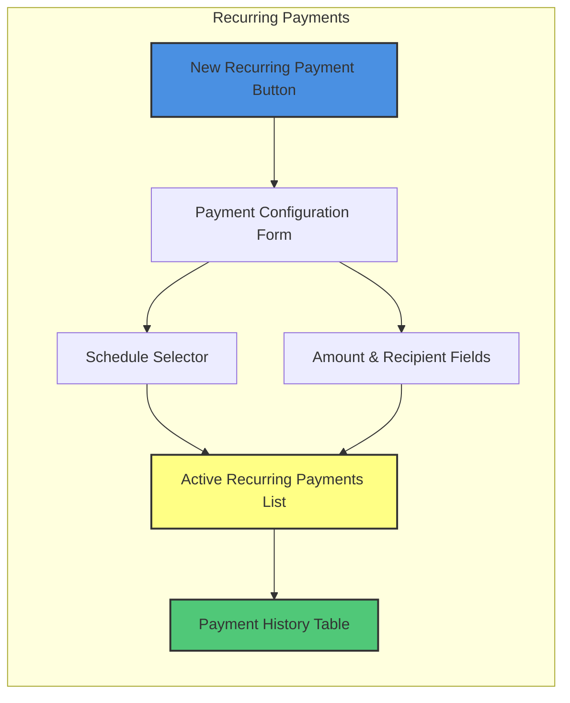
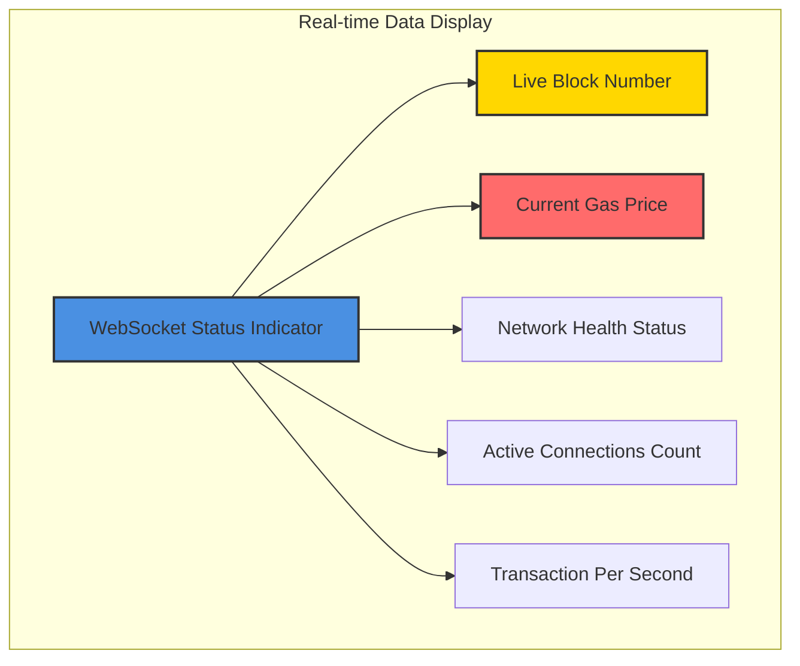
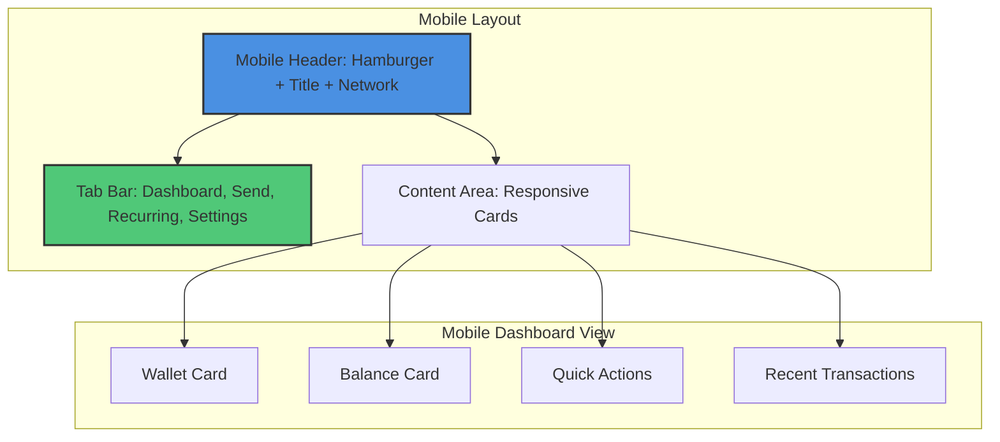

# Nitrolite UI/UX Mockup Diagrams

## Dashboard Layout



## Send Transaction Flow



## Recurring Payments Interface



## Real-time Data Components



## Mobile Responsive Layout



## Dark/Light Mode Components

```mermaid
graph LR
    subgraph "Theme System"
        A[Theme Provider]
        B[CSS Variables]
        C[UI Components]
        D[Dark Theme]
        E[Light Theme]
    end
    
    A --> B
    A --> C
    B --> D
    B --> E
    C --> D
    C --> E
    
    style A fill:#9B59B6,stroke:#333,stroke-width:2px
    style D fill:#34495E,stroke:#33,stroke-width:2px
    style E fill:#ECF0F1,stroke:#333,stroke-width:2px